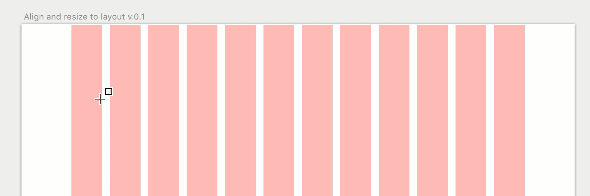

# Align and resize to layout  v.0.1
_Align and resize layers to your layout in Sketch_

When working in a Sketch.app document everything is designed around the layout. I thought it would be nice to quickly align and resize elements to the layout. So I wrote a little script to do just that. You can quickly align and resize the width of a element.

Enjoy!

## Installation

### Download the zip
1. Download and open [align-and-resize-to-layout-master.zip](https://github.com/KevinvBre/Align-and-resize-to-layout/archive/master.zip)
2. Double click on the plugin and open up Sketch.

## How to Use
Select `Plugins ▸ Align to layout` in the Sketch menu bar or use the keyboard shortcuts.

**Keyboard Shortcuts**

| *Shortcut*                                        | *Action*                          |
|---------------------------------------------------|-----------------------------------|
| <kbd>Command</kbd> + <kbd>CTRL</kbd> + <kbd>Arrow Left</kbd> | Align selection to layout left
| <kbd>Command</kbd> + <kbd>CTRL</kbd> +  <kbd>Arrow Right</kbd> | Align selection to layout Right
| <kbd>Command</kbd> + <kbd>CTRL</kbd> + <kbd>⇧ shift</kbd> + <kbd>Arrow Left</kbd> | Resize selection to layout left
| <kbd>Command</kbd> + <kbd>CTRL</kbd> + <kbd>⇧ shift</kbd> + <kbd>Arrow Right</kbd> | Resize selection to layout right

## Version history

* 0.1 Added first version of the plugin

---
